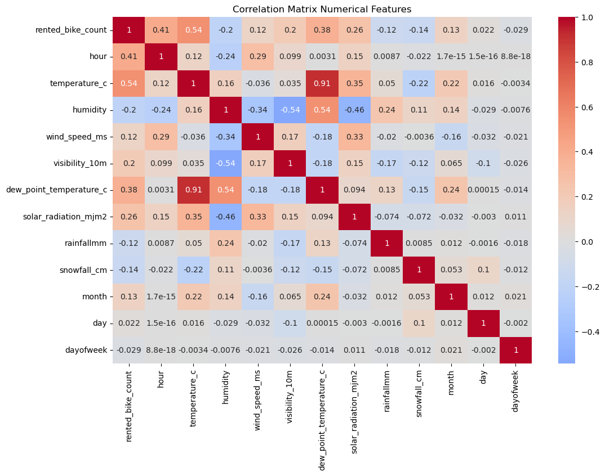
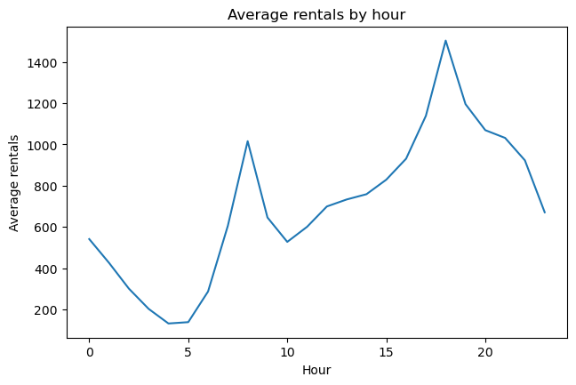

# Seoul Bike Sharing Demand Prediction


## Problem Statement
The Seoul Bike Sharing program has been a significant success in promoting eco-friendly transportation and reducing traffic congestion. However, one of the challenges faced by the program is ensuring an adequate supply of bikes at each station throughout the day. The goal of this project is to predict the number of bikes required at each hour to minimize waiting times and improve user satisfaction.

## Objective
The primary objective of this project is to develop a machine learning model that can accurately predict the number of bikes required at each hour based on historical data and weather conditions. This will help in optimizing the distribution of bikes across different stations and ensuring a smooth user experience.

## Approach
### Data Preprocessing:

1. Clean the dataset by handling missing values and outliers.

2. Convert categorical variables into numerical representations.

3. Normalize or standardize the numerical features.

### Exploratory Data Analysis (EDA):

1. Analyze the distribution of bike rentals across different hours, days, and seasons.

2. Identify correlations between bike rentals and weather conditions.

3. Visualize the data to gain insights into patterns and trends.

### Model Selection and Parameter Tuning:
- Experiment with various machine learning algorithms such as Linear Regression, Decision Trees, Random Forest, and XGBoost.
- Evaluate the performance of each model using metrics like Mean Squared Error (MSE), and R-squared, while fine tuning hyperparameters to come up with the best outcome.

### Model Training and Evaluation:
- Split the dataset into training and testing sets.
- Train the best performing model on the training data.

### Deployment:

Deploy the trained model as a web service or API.

Integrate the model with the bike sharing system to provide real-time predictions.

## Architecture
The project follows a modular architecture with separate components for data preprocessing, model training, and deployment. The model is trained on historical data and weather conditions to predict the number of bikes required at each hour. The trained model is then deployed as a web service or API to provide real-time predictions.

### Components:
1. Data Pipeline:
    - Data Cleaning: Handle missing values and outliers in the dataset.
    - Dataset: Kaggle Seoul Bike Sharing Demand dataset with 8760 records.

2. Model Training:
    - Algorithms: Linear Regression, Decision Trees, Random Forest, XGBoost.
    - Evaluation Metrics: Mean Squared Error (MSE), R-squared.
    - Dictvectorizer for encoding categorical variables.

3. Deployment:
    - Fly.io for deploying the model as a web service.

4. Web Service:
    - Flask for creating a RESTful API.
    - Docker for containerization.
    - Logging for tracking events and errors.

5. Containerization with Docker:
    - Dockerfile for building the Docker image.
    - Pipfile for managing dependencies.


## Project Structure

1. app
    - data
        - seoul+bike+sharing+demand.zip: Contains the dataset.
        - SeoulBikeData.csv: Contains the extracted dataset into csv format.
    - logs: Contains log files for tracking events and errors.
        - app.log
        - training.log
    - models
        - [bike_sharing_model.pkl](/app/models/bike_sharing_model.pkl): Contains the trained model, i.e the serialized model and DictVectorizer saved prior to training.
    - notebooks
        - [notebook.ipynb](/app/notebooks/notebook.ipynb): Contains data preparation, EDA, and model training.
        - [testing_notebook.ipynb](/app/notebooks/testing_notebook.ipynb) - Contains logic for testing the web service (Both locally and deployed).
    - scripts
        - [training_script.py](/app/scripts/training_script.py): Contains logic for training the model.
    - [app.py](/app/app.py): Contains the Flask application for the web service.
    - Configuration files
        - Pipfile
        - Pipfile.lock
2. Dockerfile : Contains the Dockerfile for building the Docker image.
3. readme.md

## Dataset
The dataset used for this project is the Seoul Bike Sharing Demand dataset, which includes the following features:


| Feature            | Description                                                                                                                                                   | Data Type  |
|--------------------|-----------------------------------------------------------------------------------------------------------------------------------------------------------------|------------|
| date               | The specific date of observation.                                                                                                                               | datetime   |
| bikecount          | The number of bikes rented at each hour.                                                                                                                         | float      |
| hoursin            | The hour of the day (0 to 23), when the observation was recorded.                                                                                               | float      |
| temperature        | The temperature at the time of observation (celsius).                                                                                                            | float      |
| humidity           | The relative humidity percentage at the time of observation.                                                                                                    | float      |
| windspeed          | The wind speed in meters per second.                                                                                                                             | float      |
| visibility         | Visibility in units of 10m.                                                                                                                                      | integer    |
| dewpointtemperature| The temperature at which air becomes saturated and produces dew (celsius).                                                                                     | float      |
| solarradiation     | The amount of solar radiation in MegaJoules per square meter.                                                                                                   | float      |
| rainfall           | The amount of rainfall in millimeters at the time of observation.                                                                                               | float      |
| snowfall           | The amount of snowfall in centimeters at time of observation.                                                                                                   | float      |
| seasons            | The season in which the observation was recorded (Winter, Spring, Summer, Autumn).                                                                            | string     |
| holiday            | Whether the observation was recorded on a holiday (Holiday/No holiday).                                                                                        | string     |
| functioningday     | Whether it is a functional day or not (NoFunc for Non-Functional Hours, Fun for Functional hours).                                                            | string     |
| month              | The month of the year when the observation was recorded.                                                                                                        | integer    |
| day                | The day of the month when the observation was recorded.                                                                                                         | integer    |
| dayofweek          | The day of the week (0 to 6, where 0 is Monday and 6 is Sunday) when the observation was recorded.                                                             | integer    |

## Preprocessing Adjustments
1. Removed the `date` column as it was redundant.
2. Replaced the `hour` column with `hoursin` and `hourcos` to enable the model comprehend the 24 hour clock format.
3. Extracted the day, day of the week, month from the `date` column.

## Model Selection
### EDA Insights
#### Numerical Feature Correlation


Strongest correlation with Bike sharing demand:
- Temperature - 0.54, Strongest positive correlation - People rent more bikes in warmer weather
- Hour - 0.42, Strong positive correlation - Indicating clear daily plans.
- Dew Point - 0.38, moderate positive correlation
- Solar radioation - 0.26, Weak positive correlation - more rentals during sunny conditions
- Humidity - -0.2, Weak negative correlation - fewer rentals when humidity is high.

Further Insights
- Temperature and Dew point show a very strong correlation (0.91)
    - This suggests multicollinearity which might neccessitate dropping one of them. Since Temperature has a stronger correlation with the rentals, I opt to keep it.
- Humidity and visibility show a strong negative correlation (-0.54), meaning the higher the humidity the the lower the visibility.
#### Rentals Distribution


**Key Insights**
1. Peak Hours
   - Morning peak - Around 8:00am with about 1000 rental bikes
   - Evening Peak - Around 6:00pm with about 1500 bikes
   - The evening peak is higher than the morning peak
   - These peaks clearly align with commuting hours
2. Low Usage Periods
   - Lowest usage - From 4-5 am with around 150 rentals
   - A gradual decrese from midnight to early morning, representing a quiet period.
3. Daily Pattern
   - M shape pattern showing 2 major peaks
   - Mid-day plateau between 10-15 hours showing steady moderate usage 

### Model Selection

My approach involved training 
- xgboost regressor
- random forest regressor
- linear regression
- decision tree regressor

_However the approach involves training all models using GridSearchCV, factoring parameter tuning_

#### Insights

1. **Model Comparison**
   - Four models were trained: XGBoost, Random Forest, Decision Tree, and Linear Regression
   - Each model has a DictVectorizer for feature transformation

2. **Performance Metrics**
   - RMSE (Root Mean Square Error) - lower is better
   - R² (R-squared) - higher is better, max is 1.0

3. **Rankings (best to worst)**:


|  Model   | RMSE   | R²   |
|  -------  |------  |-----  |
|   XGBoost  | 148.23  | 0.947   |
|   Random Forest   | 178.35   | 0.924   |
|   Decision Tree   | 351.77   | 0.703   |
|   Linear   | 445.93   | 0.523   |

4. **XGBoost Configuration**:
   - 500 estimators
   - Max depth: 8
   - Learning rate (eta): 0.1
   - Lambda (L2): 0.1

XGBoost was clearly the best performing model with 94.7% of variance as in the final_models. The linear model performed poorly, suggesting non-linear relationships in the data.

## Instructions to Run the Project
### Prerequisites
- Python 3.12
- Pipenv: To create the virtual environment and manage dependencies.
- Docker (optional) : To run the application in a containerized environment.

### Setup
To set up the project locally, follow these steps:
1. Clone the repository: `git clone git@github.com:okellodaniel/bike_share_regression.git`
2. Navigate to the project directory: `cd bike_share_regression`
3. Install the required dependencies: `pip install -r requirements.txt`

## Running the Project
### Locally
1. Ensure that pipenv installed, you follow instructions on installation [here](https://pipenv.pypa.io/en/latest/installation.html).
2. Install the dependencies: `pipenv install`
3. Activate the virtual environment: `pipenv shell`
4. Navigate to the [app] directory (cd app) and run the following command to train the model: `python scripts/training_script.py`
5. Start the Flask application: `python app.py`
6. Access the web service at [`http://localhost:5000`](http://localhost:5000) to get predictions.
7. Access the web dashboard at [`http://localhost:5000/dashboard`](http://localhost:5000/dashboard) to visualize the data.

**Note**: Use the sample payload below to test the API using `curl`.
```bash
curl -X POST http://localhost:5000/ -H "Content-Type: application/json" -d "{
  'temperature_c': 12.2,
  'humidity': 14,
  'wind_speed_ms': 1.6,
  'visibility_10m': 1896,
  'dew_point_temperature_c': -14.5,
  'solar_radiation_mjm2': 2.75,
  'rainfallmm': 0.0,
  'snowfall_cm': 0.0,
  'seasons': 'spring',
  'holiday': 'no_holiday',
  'functioning_day': 'yes',
  'month': 3,
  'day': 3,
  'dayofweek': 5,
  'hour_sin': -0.25881904510252035,
  'hour_cos': -0.9659258262890684
}"
```

_You can also use the [testing notebook](./app/notebooks/testing_notebook.ipynb) to test the web service locally._

### Using Docker
1. Navigate to the project directory: `cd bike_share_regression`
2. Build the Docker image in the terminal: `docker build -t bike-sharing-prediction .`
3. Run the Docker container: `docker run -p 5000:5000 bike-sharing-prediction`
4. Access the web service at [`http://localhost:5000`](http://localhost:5000).

### Testing the Deployed Version
1. Access the deployed version at [`https://bike-share-regression.fly.dev/`](`https://bike-share-regression.fly.dev/`) to get predictions.

## Testing with Curl
To test the API using `curl`, use the following command with the sample payload:
```bash
curl -X POST http://localhost:5000/ -H "Content-Type: application/json" -d "{
  'temperature_c': 12.2,
  'humidity': 14,
  'wind_speed_ms': 1.6,
  'visibility_10m': 1896,
  'dew_point_temperature_c': -14.5,
  'solar_radiation_mjm2': 2.75,
  'rainfallmm': 0.0,
  'snowfall_cm': 0.0,
  'seasons': 'spring',
  'holiday': 'no_holiday',
  'functioning_day': 'yes',
  'month': 3,
  'day': 3,
  'dayofweek': 5,
  'hour_sin': -0.25881904510252035,
  'hour_cos': -0.9659258262890684
}"
```

## Results
The model achieved an R-squared value of 0.94, indicating a strong correlation between the predicted and actual bike demand.

## Areas of Improvement
1. Normalizing the target variable to improve model performance.
2. Incorporating additional features such as traffic data and events to enhance predictions.
3. Implementing a more sophisticated time series model to capture temporal patterns.
4. Optimizing the model for real-time predictions and scalability.
